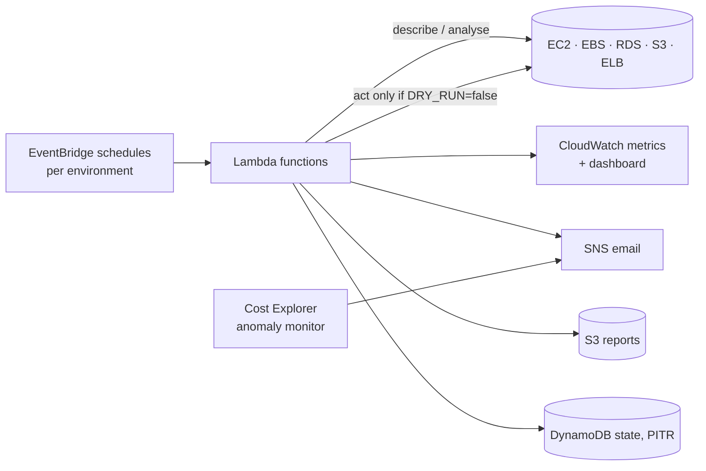

# AWS FinOps Automation (Experiment)

Scheduled Lambda functions, deployed with Terraform, that look for common AWS waste: gp2 volumes, orphaned snapshots, unattached Elastic IPs, unused security groups, idle load balancers, and over-sized EC2/RDS. They report findings to CloudWatch and SNS, alongside a Cost Explorer anomaly monitor.

> **Experiment, not a product.** I built this in my own AWS dev account to explore FinOps automation. It hasn't been run against a client or a production estate, so there are **no measured savings**. Earlier versions of this README quoted savings figures, and I've removed them. The functions vary a lot in maturity; the table below says which is which.

---

## 1. Problem

Most AWS waste is boring and repetitive: gp2 volumes nobody migrated, snapshots of long-deleted volumes, EIPs left behind after a test. Finding them is easy. **Acting on them safely is the hard part**, because an automated "cleanup" that deletes the wrong snapshot is worse than the bill it saved.

## 2. Architecture


```mermaid
flowchart LR
  EB[EventBridge schedules<br/>per environment] --> L[Lambda functions]
  L -->|describe / analyse| AWS[(EC2 · EBS · RDS · S3 · ELB)]
  L -->|act only if DRY_RUN=false| AWS
  L --> CW[CloudWatch metrics<br/>+ dashboard]
  L --> SNS[SNS email]
  CE[Cost Explorer<br/>anomaly monitor] --> SNS
  L --> S3[(S3 reports)]
  L --> DDB[(DynamoDB state, PITR)]
```

Terraform: `terraform/modules/{iam,lambda,monitoring,storage}`, composed in `terraform/environments/{dev,staging,production}`. Lambda packages are built from `lambda-functions/` by `archive_file`.

### Function maturity

| Function | What it does | Status |
|---|---|---|
| `cost_optimizer` | gp2 → gp3; delete orphaned snapshots > 30 days | **Acts.** Dry-run by default; skips AMI/Backup/`finops:keep` snapshots |
| `unused_resources_cleanup` | Unused SGs, unattached EIPs; reports idle ALBs | **Acts.** Dry-run by default; SG usage checked via ENIs + references |
| `s3_lifecycle_optimizer`, `rds_optimizer`, `ri_optimizer`, `spot_optimizer`, `ml_cost_anomaly_detector` | Analysis and recommendations | Report-only, simple heuristics |
| `ec2_rightsizing` | CPU-based rightsizing suggestions | Report-only. **Known bugs:** suggests a non-existent `m5.medium`, and the price table is inaccurate |
| `data_transfer_optimizer` | NAT/ELB data transfer review | Broken: calls an ELB API on the EC2 client |
| `eks_cost_optimizer`, `k8s_resource_optimizer` | Kubernetes rightsizing | Stubs; return sample output |
| `multi_account_governance` | Tag compliance, budgets across accounts | Stub; returns hardcoded values |

## 3. Key decisions and trade-offs

- **Safe by default.** Anything destructive is a dry run unless the function's environment explicitly sets `DRY_RUN=false`. An event can always force a dry run (`{"dryRun": true}`). `tests/test_dry_run.py` checks this in CI.
- **Protect what looks orphaned but isn't.** A snapshot whose volume is gone is often an AMI's backing snapshot or an AWS Backup recovery point, so both are excluded. Security groups count as "in use" if *any* network interface (RDS, Lambda, ELB, endpoints) or another group's rules reference them, not just EC2 instances.
- **Report first, act later.** Most functions only publish findings. For a real estate I'd keep it that way and add an approval step before anything changes.
- **Schedules per environment.** Dev runs on weekday office hours so results can be inspected; production would run nightly.

## 4. Known limitations / what I'd do next

- **The IAM role is broad.** It allows delete/modify on `Resource: "*"`. Next: tag-conditioned permissions, so the automation can only touch resources tagged `finops:managed=true`.
- **No approval workflow.** Next: proposed actions → SNS/Slack with approve/reject → a second Lambda executes the approved ones.
- **Savings estimates are list-price approximations** in the function code. Next: use the Cost Explorer / Pricing APIs and record actual before/after spend.
- **Several functions are stubs or buggy** (see table). I'd delete or finish them before calling this more than an experiment.
- **Python 3.9 runtime** needs upgrading to a supported version.

## 5. Evidence

- `tests/test_dry_run.py`: proves no modify/delete/release call is made in dry-run mode, and that protected snapshots and in-use security groups are never deleted in live mode.
- Terraform for dev/staging/production validates in CI.

## 6. Run it yourself

```bash
# Deploy to a sandbox account (functions start in dry-run mode)
cd terraform/environments/dev
terraform init -backend-config=../dev.tfbackend   # or -backend=false to try locally
terraform apply -var="notification_email=you@example.com"

# Invoke a function and read what it *would* do
aws lambda invoke --function-name <dev-cost-optimizer> --payload '{"dryRun": true}' \
  --cli-binary-format raw-in-base64-out out.json && cat out.json
```

**Cost:** a few dollars a month (Lambda, EventBridge, CloudWatch, S3, DynamoDB on-demand). Cost Explorer API calls are $0.01 each. **Run `terraform destroy` when you're done.**

---

**Abdihakim Said**, AWS Solutions Architect · CKA. Contact details are on my [GitHub profile](https://github.com/abdihakim-said).
