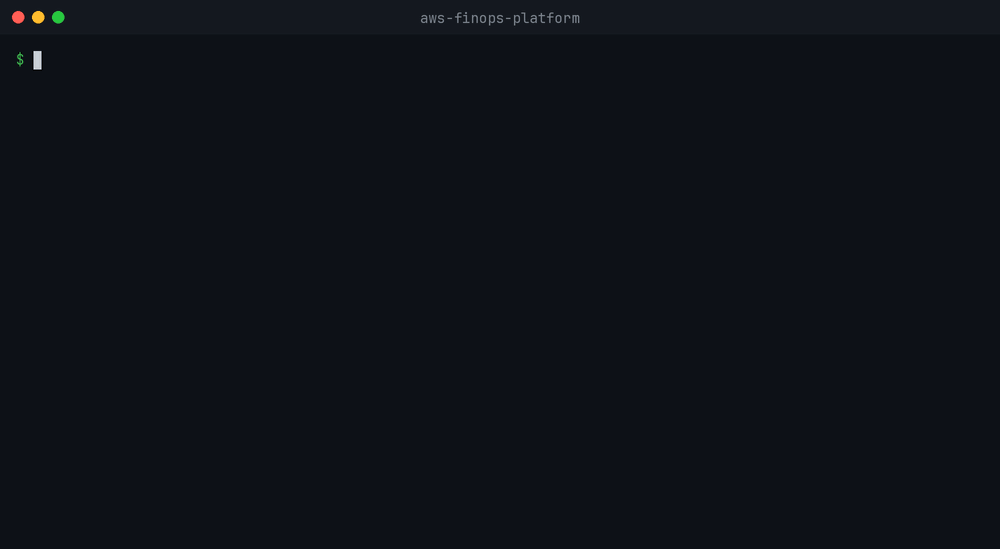
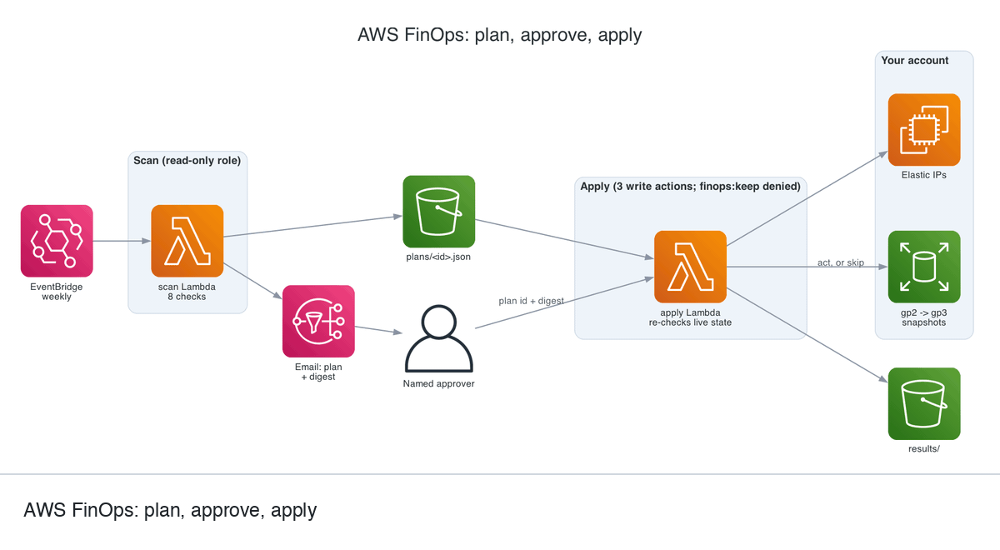
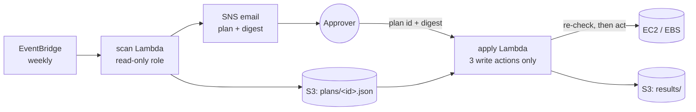

# AWS FinOps: find the waste, fix it only after approval

[](https://github.com/abdihakim-said/aws-finops-platform/actions/workflows/ci.yml)

An open-source tool that finds common AWS waste and turns it into a **plan**, like `terraform plan` for cost clean-up. Nothing changes until a named person approves that exact plan. At that point every action is re-checked against the live resource, so anything that changed since the scan is skipped.

Finding waste is easy. **Removing it safely is the hard part**: an automated clean-up that deletes the wrong snapshot or slows down a production disk costs more than the bill it saved. This tool is built around that problem.





<sub>Static diagram: [docs/images/architecture.png](docs/images/architecture.png)</sub>


```mermaid
flowchart LR
  S[EventBridge<br/>weekly] --> SCAN[scan Lambda<br/>read-only role]
  SCAN --> PLAN[(S3: plans/&lt;id&gt;.json)]
  SCAN --> MAIL[SNS email<br/>plan + digest]
  MAIL --> P((Approver))
  P -- plan id + digest --> APPLY[apply Lambda<br/>3 write actions only]
  PLAN --> APPLY
  APPLY -->|re-check, then act| AWS[(EC2 / EBS)]
  APPLY --> RES[(S3: results/)]
```

## What it checks

| Check | Result | Notes |
|---|---|---|
| **gp2 volumes in use** | Action: convert to gp3 | Provisions IOPS and throughput to **match gp2's baseline** (3 IOPS/GB up to 16,000; 250 MiB/s over 170 GiB). A plain `gp3` switch makes large volumes slower. The saving is priced after the extra IOPS. |
| **Orphaned snapshots** | Action: delete | Source volume gone, older than 30 days, and **not** backing an AMI, managed by AWS Backup or DLM, a copied snapshot, or tagged `finops:keep`. |
| **Unattached Elastic IPs** | Action: release | $3.65/month each since public IPv4 became chargeable. |
| Unattached EBS volumes | Report only | Deleting loses data. Snapshot first, then delete. |
| Idle load balancers | Report only | ALB `RequestCount` / NLB `NewFlowCount` of zero over 14 days, on load balancers older than that window. |
| Idle RDS instances | Report only | Zero `DatabaseConnections` over 14 days. Missing metrics are treated as *unknown*, not idle. |
| EC2 rightsizing | Report only | From **AWS Compute Optimizer**, not a home-grown CPU rule. Resizing needs a maintenance window. |
| S3 stale multipart uploads | Report only | Billed but invisible in the console. The fix is an `AbortIncompleteMultipartUpload` lifecycle rule. |

Only the three safe, reversible-in-spirit actions can be applied. Everything that loses data or affects availability is reported for a human to decide.

## Try it without an AWS account

```bash
python -m venv .venv && . .venv/bin/activate
pip install -e ".[dev]"
python examples/demo.py      # mocked AWS account (moto)
pytest -q                    # 33 tests
```

Output of the demo, abridged:

```
Can be applied after approval: 4
  $    20.00/mo  gp2_volume        vol-73ee…   2000 GiB gp2 -> gp3 at 6000 IOPS / 250 MiB/s (same or better performance)
  $     3.65/mo  unattached_eip    eipalloc-…  Elastic IP 127.152.105.110 is not associated with anything
  $     0.16/mo  gp2_volume        vol-3af8…   8 GiB gp2 -> gp3 at 3000 IOPS / 125 MiB/s (same or better performance)
          n/a    orphaned_snapshot snap-c646…  Source volume no longer exists; not used by an AMI, AWS Backup or DLM;
                                               up to $25.00/month (snapshots are incremental)
Report only (needs a human): 2
  $    16.43/mo  idle_load_balancer forgotten-alb  application load balancer with no traffic in 14 days
  $    10.00/mo  unattached_volume  vol-f964…      100 GiB gp2 not attached to any instance. Snapshot it, then delete it

THE WORLD CHANGES: someone attaches the IP and tags the big disk finops:keep

APPLY as 'Jane Doe'
  skipped      modify_volume:us-east-1:vol-73ee…        volume is tagged finops:keep
  skipped      release_address:us-east-1:eipalloc-…     address is now associated
  applied      modify_volume:us-east-1:vol-3af8…
  applied      delete_snapshot:us-east-1:snap-c646…
```

## Run it against your account (read-only)

```bash
pip install .
finops --profile readonly scan --region eu-west-2 --region us-east-1     # writes plan.json, changes nothing
finops --profile ops apply plan.json --approved-by "Jane Doe" --preview  # re-check only
finops --profile ops apply plan.json --approved-by "Jane Doe"            # asks you to type the plan digest
```

`scan` needs only read permissions (the `ReadOnlyAccess` managed policy is enough). `apply --only <action-id>` applies a subset.

## Deploy it (Terraform)

```hcl
module "finops" {
  source             = "github.com/abdihakim-said/aws-finops-platform//terraform/modules/finops"
  regions            = ["eu-west-2", "us-east-1"]
  notification_email = "platform-team@example.com"
  enable_apply       = false   # report-only until the team trusts the plans
}
```

This creates:

- a weekly scan function
- a private, versioned, encrypted bucket for plans and results
- an SNS topic that emails each plan with its digest
- an apply function
- an alarm if a scan fails

**The two functions have separate IAM roles.** The scan role can only read. The apply role can only call `ModifyVolume`, `DeleteSnapshot` and `ReleaseAddress`, with an explicit `Deny` on anything tagged `finops:keep=true`. See [SECURITY.md](SECURITY.md).

To approve a plan from the email:

```bash
aws lambda invoke --function-name finops-apply --cli-binary-format raw-in-base64-out \
  --payload '{"plan_id":"<id>","plan_digest":"<digest>","approved_by":"Jane Doe"}' out.json
```

**Running cost:** well under $1/month for a weekly scan (Lambda, S3, SNS, CloudWatch). CloudWatch `GetMetricStatistics` calls are the main variable.

## Design decisions

- **Plan, approve, apply instead of a cron that deletes things.** The approver sees exactly what will change. The digest proves the plan they approved is the one that runs, and the 7-day expiry stops stale plans being applied.
- **Re-check at apply time.** The world moves between Monday's scan and Wednesday's approval. An action is skipped when its resource no longer matches the reason it was proposed, *or when the check can't be completed*, for example on throttling. It is never treated as "probably fine".
- **Report-only is a feature.** Deleting volumes, stopping databases and removing load balancers needs context the tool doesn't have, so it says what it found and why, and leaves the call to a person.
- **Honest numbers.** Savings use us-east-1 list prices and say so. A snapshot's saving is shown as an upper bound and excluded from totals, because the billed size of an incremental snapshot isn't exposed. Rightsizing comes from Compute Optimizer rather than a guess.

## Limitations

- Prices are us-east-1 list prices. Other regions and discounts (Savings Plans, EDP) differ; pass your own `Prices`.
- One account per deployment. For an organisation, run it per account, or extend `scan()` to assume a role in each member account.
- Compute Optimizer must be opted in for rightsizing findings; otherwise the plan notes that the check was skipped.
- Idle checks use a fixed window (14 days by default). Month-end batch systems may look idle mid-month, which is one reason those findings are report-only.

## Layout

```
finops/          checks.py (read-only checks) · scan.py · apply.py · model.py · prices.py · handlers.py · cli.py
tests/           moto-backed tests: checks, apply safety, Lambda handlers, CLI
terraform/       modules/finops (the deployment) · examples/basic
examples/demo.py offline walkthrough
```

## History

v2 (September 2026) is a rewrite. v1 was a set of 12 scheduled Lambdas. A review found several stubs, hardcoded prices, and an S3 function that rewrote bucket lifecycle policies without a dry run. v2 keeps the idea and replaces the implementation with the plan and approval model above.

---

MIT licensed · [Abdihakim Said](https://abdihakim-said.github.io), HumanLayer AI Ltd
